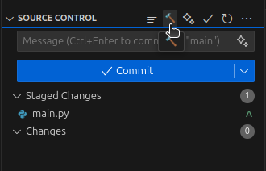

# Commit Craft

CommitCraft is a VSCode extension that automatically generates meaningful Git commit messages based on your staged changes. It uses AI to analyze your code diffs and suggests well-structured commit messages following conventional commit standards.

## Features

🚀 AI-powered commit message generation

📝 Automatically inserts messages into the commit input box

🛠 Supports only staged file changes for precise commit messages

🔄 Seamless Git integration in VSCode

## Usage

1. Stade your changes in VSCode.

2. Click on this 🔨 icon and it will automatically generate and insert commit message. (It's possible that it takes some time as it depends on your internet speed)

## Configuration

Ensure you have an internet connection for API calls.  
This extension relies on an AI service to generate commit messages.

## Troubleshooting

If you encounter issues:

Make sure Git is initialized in your project.  
Restart VSCode and try again.  
Check the output logs in VSCode for debugging.

## License

MIT License. See [LICENSE](LICENSE).